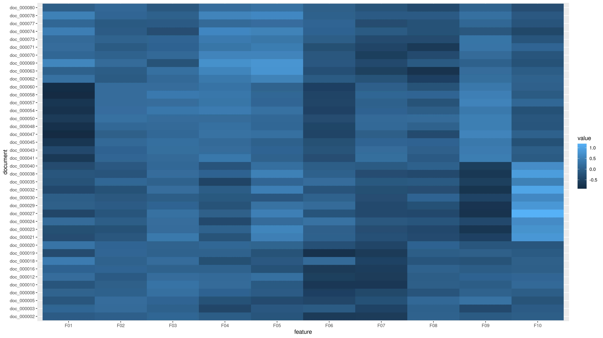

# Лабораторная работа №3 (Векторизация текста)

## Синопсис лекции

**Векторизация** - преобразование текста из символьного представления в последовательность вещественных чисел (векторов) заданного размера.
**Tf-idf** - метрика, позволяющая оценить важность термина с точки зрения его использования для автоматической обработки некоторого корпуса. Как видно из названия, значение данной метрики прямо пропорционально частоте употребления токена в корпусе (term frequency) и обратно пропорционально количеству фрагментов текста, в которых данный токен употребляется (inverse document frequency).
**w2v** - метод векторизации текста, основанный на построении предсказательной (generative) модели, обеспечивающей кодирование токенов, встречающихся в одинаковом контексте, близкими значениями векторов.
**glover** - метод векторизации текста, основанный на построении описательной (discriminative) модели, обучение которой осуществляется на основе матрицы "термин-документ" (term-document matrix).



## Задание

1. По сформированной в результате выполнения [первой лабораторной работы](/tasks/task_01) аннотации обучающей выборки в формате `tsv` построить словарь наиболее частых слов (словарь должен содержать как сами токены, так и количество их упоотреблений в тестовой выборке) и матрицу "термин-документ" (term-document matrix). Результаты необходимо сохранить во внешние файлы в произвольном формате. Использование стандартных библиотечных реализаций данных преобразований не разрешается. Для получения дополнительных баллов здесь и далее требуется убирать из текста стоп-слова и пунктуацию, а также низкочастотные токены. Также для получения дополнительных баллов по данному пункту необходимо учитывать эффективность хранения разреженных структур данных на диске.
1. Разработать метод, позволяющий преобразовать произвольный текст в вектор частот токенов, содержащихся в данном тексте, с использованием словаря наиболее частых слов, полученного на предыдущем шаге. Предложить способ обработки токенов, отсутствующих в словаре (простейший вариант - пропуск таких токенов).
1. Разработать метод, позволяющий преобразовать произвольный текст в единичную матрицу (каждая строка соответствует одному токену входного текста и содержит только одну единицу, остальные ячейки заполнены нулями, каждый столбец соответствует одному токену словаря), с использованием словаря, полученного ранее.
1. Разработать метод, позволяющий преобразовать произвольный текст в матрицу частот токенов (каждая строка соответствует одному токену входного текста и содержит только одно ненулевое значение, остальные ячейки заполнены нулями, каждый столбец соответствует одному токену словаря), с использованием словаря наиболее частых слов, полученного ранее.
1. Разработать метод, позволяющий преобразовать произвольный текст в вектор значений `tf-idf`, с использованием словаря наиболее частых слов и матрицы "термин-документ", полученных ранее.
1. Разработать метод, позволяющий преобразовать произвольный текст в матрицу частот и матрицу значений `tf-idf` (каждой строке матрицы соответствует одно предложение текста, каждому столбцу - один токен предложения), с использованием словаря наиболее частых слов и матрицы "термин-документ", полученных ранее. Предложить решение проблемы неодинакового количества токенов в предложении (наиболее простой вариант - заполнить "лишние" ячейки матрицы нулями). Реализовать способ подсчета векторного представления документа на основе векторных представлений отдельных предложений (наиболее простой вариант - подсчитать среднее значение по строкам матрицы).
1. Реализовать метод, позволяющий векторизовать произвольный текст с использованием нейронных сетей (предлагается использовать стандартную реализацию модели `w2v` или `glove`). Выбранную модель необходимо обучить на тестовой выборке.
1. Реализовать подсчет косинусного расстояния между векторными представлениями текста, продемонстрировать на примерах, что для семантически близких слов модель генерирует вектора, для которых косинусное расстояние меньше, чем для семантически далеких токенов. Для получения дополнительных баллов требуется также выполнить серию экспериментов с гиперпараметрами модели, выбранной на предыдущем шаге, для каждого набора гиперпараметров измерить значение косинусного расстояния для некоторого тестового набора пар семантически близких и семантически далекиз токенов, сформулировать вывод о том, какой набор гиперпараметров является оптимальным.
1. Применить какой-либо метод сокращения размерностей векторов (в простейшем случае - `PCA`, допускается использование библиотечной реализации), полученных базовыми способами векторизации, а именно:
    * кодированием текста в виде единичной матрицы (здесь также необходимо предложить способ преобразования матрицы в вектор);
    * кодированием текста в виде последовательности частот токенов;
    * кодированием текста в виде наборов значений метрики `tf-idf`.
1. С использованием разработанного метода подсчета косинусного расстояния сравнить эффективность методов векторизации с использованием нейронных сетей и эффективность базовых методов векторизации с последующим сокращением размерности. Сформулировать вывод о том, применение какого способа позволяет получить лучшие результаты на выбранном датасете.
1. Реализовать метод, осуществляющий векторизацию произвольного текста следующим образом:
    * сегментация текста на предложения и токены;
    * формирование векторных представлений каждого токена по-отдельности с использованием выбранной модели векторных представлений текста, основанной на нейронных сетях;
    * подсчет взвешенного среднего векторных представлений токенов каждого предложения, в качестве веса использовать метрику `tf-idf`, подсчитанную по обучающей выборке;
    * подсчет векторного представления документа по векторным представлениям составляющих его предложений в соответствии с подходоим, предложенным ранее.
1. Выполнить векторизацию тестовой выборки с использованием метода, реализованного на предыдущем шаге. Результаты сохранить в формате `tsv` в соответствии со следующей структурой:
```tsv
<doc_id_1>	<embedding_1_component_1>	<embedding_1_component_2>	<embedding_1_component_3>	...	<embedding_1_component_M>
<doc_id_2>	<embedding_2_component_1>	<embedding_2_component_2>	<embedding_2_component_3>	...	<embedding_2_component_M>
...
<doc_id_N>	<embedding_N_component_1>	<embedding_N_component_2>	<embedding_N_component_3>	...	<embedding_N_component_M>
```

Пример фрагмента результирующего файла:
```tsv
001	0.1	0.2	0.9	0.4
002	0.2	0.2	0.5	0.4
```

Результаты выполнения работы необходимо разместить в файле `/projects/<PROJECT_NAME>/assets/annotated-corpus/test-embeddings.tsv` (путь указан относительно корня репозитория, `<PROJECT_NAME>` следует заменить на название проекта).  
